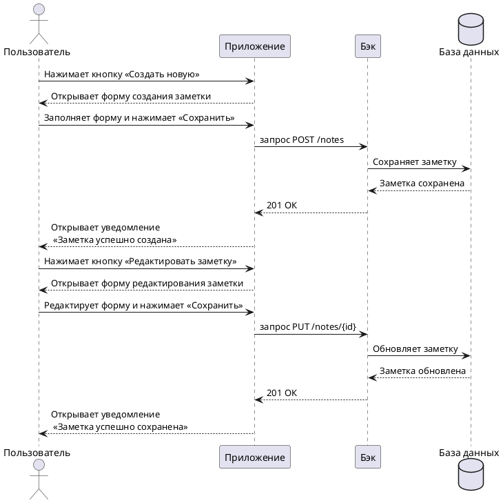

Пользовательский сценарий "Создание и редактирование заметки"

```puml

@startuml
actor Пользователь
participant Приложение
participant Бэк
database "База данных"

Пользователь -> Приложение: Нажимает кнопку «Создать новую»
Пользователь <-- Приложение: Открывает форму создания заметки
Пользователь -> Приложение: Заполняет форму и нажимает «Сохранить»
Приложение -> Бэк: запрос POST /notes
Бэк -> "База данных": Сохраняет заметку
Бэк <-- "База данных": Заметка сохранена
Бэк --> Приложение: 201 ОК
Приложение --> Пользователь: Открывает уведомление\n «Заметка успешно создана»

Пользователь -> Приложение: Нажимает кнопку «Редактировать заметку»
Пользователь <-- Приложение: Открывает форму редактирования заметки
Пользователь -> Приложение: Редактирует форму и нажимает «Сохранить»
Приложение -> Бэк: запрос PUT /notes/{id}
Бэк -> "База данных": Обновляет заметку
Бэк <-- "База данных": Заметка обновлена
Бэк --> Приложение: 201 ОК
Приложение --> Пользователь: Открывает уведомление\n «Заметка успешно сохранена»

@enduml

@enduml
```